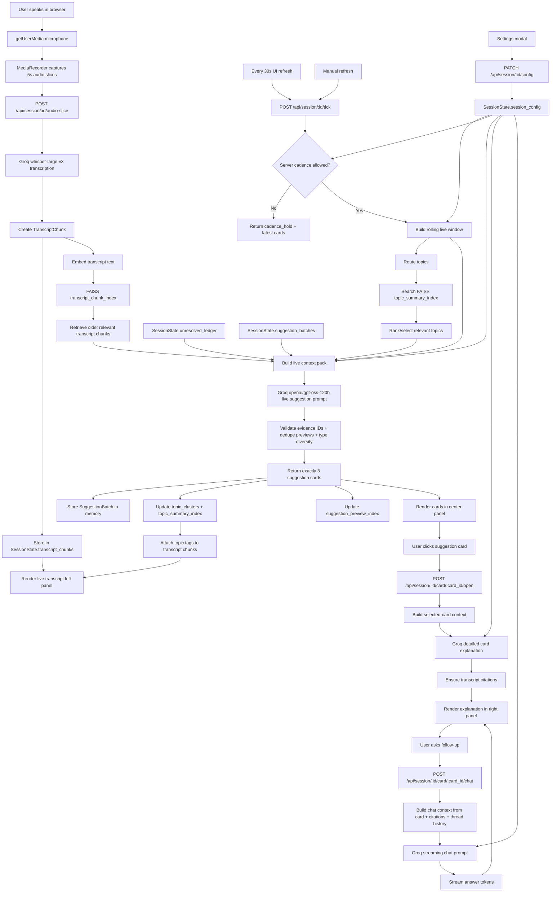

# twinmind-live-copilot

Live meeting copilot monorepo with:

- **Frontend**: Next.js + React + Tailwind
- **Backend**: FastAPI + Python
- **Models**:
  - STT: `whisper-large-v3` via Groq SDK
  - Suggestions/chat: `openai/gpt-oss-120b` via OpenAI SDK against Groq base URL
- **Memory**:
  - In-memory session state
  - Local embedding service (`BAAI/bge-small-en-v1.5`) + FAISS `IndexFlatIP`
- **No login**, **no persistence across reloads**, **no TTS**, **no LiveKit**, **no LangChain**.

## Product behavior

- Browser records mic audio in 5s slices (`MediaRecorder`).
- Backend transcribes each slice immediately.
- Backend builds rolling 25s logical window.
- Every 30s tick:
  - topic routing (recent-topic score + fallback ranker mode)
  - context packing
  - exactly 3 new live suggestion cards
- Older cards remain visible and clickable.
- Clicking a card opens immediate grounded explanation + card-specific chat.
- Every explanation/chat answer includes transcript citations (`chunk_id` + `[HH:MM:SS–HH:MM:SS]`).
- Session can be exported as JSON from in-memory state.

## Approach overview

This is a thin, in-memory copilot. The mental model is: capture audio, transcribe fast, choose what we are talking about, retrieve only what is relevant, generate exactly 3 grounded cards, and let the user dig into any card with citations.

### Pipeline at a glance

1. Capture: browser records 5s audio slices and posts them to the backend.
2. Transcribe: Groq `whisper-large-v3` returns text per slice; chunk is added to `SessionState.transcript_chunks` and embedded into the FAISS `transcript_chunk_index`.
3. Tick (every ~30s or manual refresh):
   - Build a rolling 25s window from the most recent chunks.
   - Route topics: pick the active topic with high confidence, otherwise fall back to a top-k ranker.
   - Pack context: window + topic summaries + retrieved older chunks + open ledger items + recent card history.
   - Generate cards: ask `openai/gpt-oss-120b` for exactly 3 cards via JSON schema.
   - Validate: enforce evidence chunk IDs, type diversity, dedup, and not-already-covered.
4. Open card: build a card-scoped context, ask the model for a grounded detailed answer with citations.
5. Card chat: a per-card thread, streamed token-by-token, still grounded to transcript citations.

### Topic routing logic

Two modes pick which topics to feed the model:

- Recent-topic mode: if the active topic still scores high (centroid + summary similarity + keyword overlap + recency) and clearly beats the runner-up, we keep using it. This avoids whiplash on every tick.
- Fallback ranker mode: when the active topic is no longer dominant, we ANN-prefilter top topics from the FAISS topic summary index and ask the model to rank the top 5 by relevance. Selected topics drive context retrieval and card grounding.

### Retrieval and context packing

- Current 25s window chunks are mandatory context.
- For each selected topic we pull a small number of older relevant transcript chunks from the FAISS chunk index, blended with topic-overlap and recency boosts.
- We add open ledger items (questions/decisions to revisit) and recent card history so the model knows what was already raised.
- Token budget is split (≈ window 55%, topic 25%, ledger 15%, history 5%); each section is trimmed before the call.

### Card validation and "covered" detection

- Each card must reference real `evidence_chunk_ids` that exist in transcript memory; otherwise it is rejected.
- We dedup card previews using a hash + FAISS embedding similarity against recent batches.
- A backend rule rejects candidates that look like stale repeats of recent cards or whose intent appears already resolved in the current window.
- The frontend marks a card as "covered" only when the user used it (chat sent) or when transcript AFTER that card's window addresses it (overlap with completion phrasing).

### Cadence and refresh

- Server enforces a configurable tick cadence (default 30s). Manual "Refresh now" forces a generation.
- If a tick is requested before the cadence elapses, the server returns `cadence_hold` and the UI countdown re-syncs to the server's `seconds_until_next` plus shows a small hint banner.
- The frontend never silently drops a 30s tick: if a tick is still in flight, the next one is queued and runs as soon as the current tick resolves.

### Configuration knobs (Settings)

Per-session, editable in the UI:

- Live window seconds, tick cadence seconds.
- Live and chat context token caps.
- Live suggestions / card detail / card chat prompt overrides (leave blank to use the optimal defaults).

## Monorepo layout

```text
backend/
  requirements.txt
  .env.example
  app/
    main.py                # API boundary (FastAPI app + endpoints)
    container.py           # composition root (wires services + adapters)
    config.py              # pydantic-settings config
    models.py              # session/transcript/card/ledger dataclasses
    schemas.py             # request/response Pydantic schemas
    export.py              # session JSON export
    prompts.py             # live + detail + chat prompts and JSON schemas
    domain/
      sessions/            # session config + service ports
      transcript/          # audio slicing, rolling window, STT (Groq Whisper)
      suggestions/         # topic routing + 3-card generation pipeline
      memory/              # context packer (live + card chat)
      chat/                # card open + streaming follow-up
    adapters/
      memory/              # embeddings + FAISS index implementations
      in_memory/           # session repository + persistence + session store
      runtime.py           # adapters that bridge ports to feature engines
    utils/                 # token budget, time utils, text normalize
  tests/
frontend/
  package.json
  .env.local.example
  app/                     # Next.js app router (page composition only)
  components/              # UI presentation
  hooks/                   # session lifecycle, recorder, refresh, card chat
  lib/                     # api client, types, state helpers
```

## Architecture / Runtime Flow



## Backend setup

1. Create and activate a virtualenv:
   - macOS/Linux:
     - `cd backend`
     - `python3 -m venv .venv`
     - `source .venv/bin/activate`
2. Install dependencies:
   - `pip install -r requirements.txt`
   - For strict local `BAAI/bge-small-en-v1.5` embeddings, prefer Python 3.12.
     On Python 3.13, the app automatically falls back to deterministic hash embeddings for runtime stability.
3. Set env vars:
   - `cp .env.example .env`
   - update values (especially `GROQ_API_KEY` if desired fallback)
4. Run API:
   - `uvicorn app.main:app --reload --port 8000`

## Frontend setup

1. Install dependencies:
   - `cd frontend`
   - `npm install`
2. Set env vars:
   - `cp .env.local.example .env.local`
   - ensure `NEXT_PUBLIC_API_BASE=http://localhost:8000`
3. Run app:
   - `npm run dev`

## End-to-end run

1. Open the frontend in your browser.
2. Open **Settings**, paste Groq API key, click **Validate + save**.
3. Allow microphone permission.
4. Click **Start meeting**.
5. Verify:
   - transcript chunks append continuously
   - cards refresh every 30 seconds with exactly 3 new cards
   - older cards remain visible
   - selecting a card opens explanation + chat with citations
6. Click **Export JSON** to download current session state.

## Core API endpoints

- `POST /api/session/start`
- `POST /api/session/{session_id}/validate-key`
- `POST /api/session/{session_id}/audio-slice`
- `POST /api/session/{session_id}/tick` (supports `?force=true` for manual refresh)
- `GET /api/session/{session_id}/state`
- `GET /api/session/{session_id}/config`
- `PATCH /api/session/{session_id}/config`
- `POST /api/session/{session_id}/card/{card_id}/open`
- `POST /api/session/{session_id}/card/{card_id}/chat` (streamed)
- `GET /api/session/{session_id}/export`

## Testing

### Backend

From `backend/`:

- `pytest -q`

Includes:

- topic routing threshold tests
- context packer token budget test
- card dedup logic test
- export structure test
- integration test for tick emitting exactly 3 cards with evidence refs

### Frontend

From `frontend/`:

- `npm test`

Includes:

- smoke test for selecting a card and opening the chat panel

## Security and key handling

- User Groq key is accepted from UI settings and kept only in session memory on backend.
- Frontend stores key in React state + `sessionStorage` only (not `localStorage`).
- Backend never writes API keys to disk.
